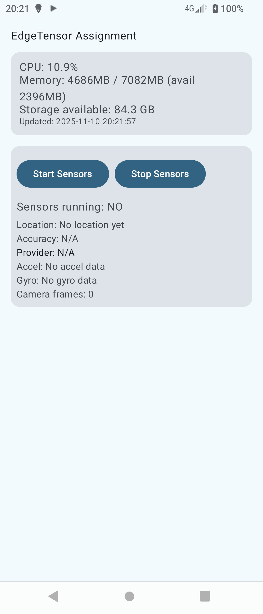
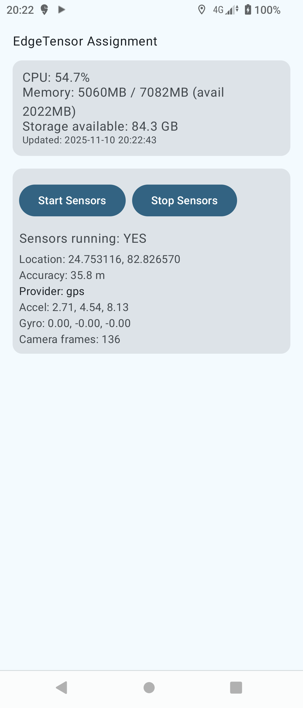
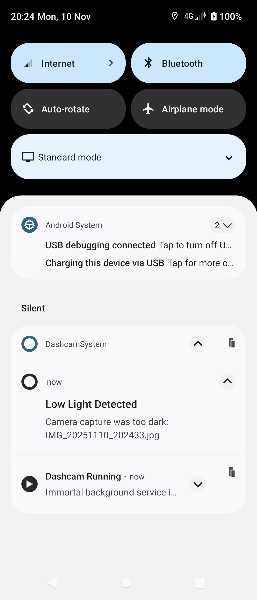
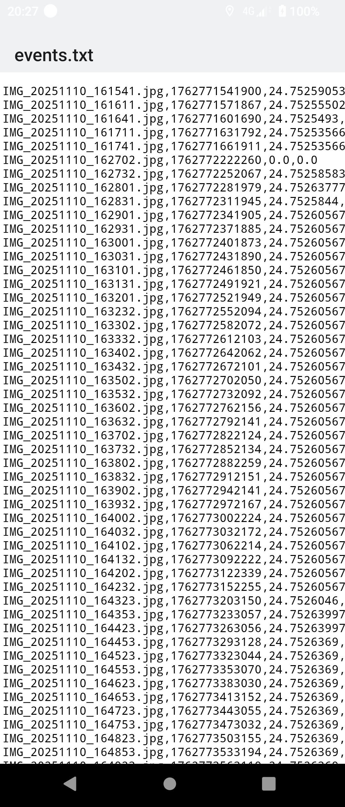
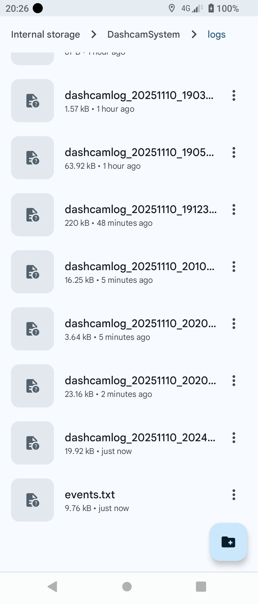
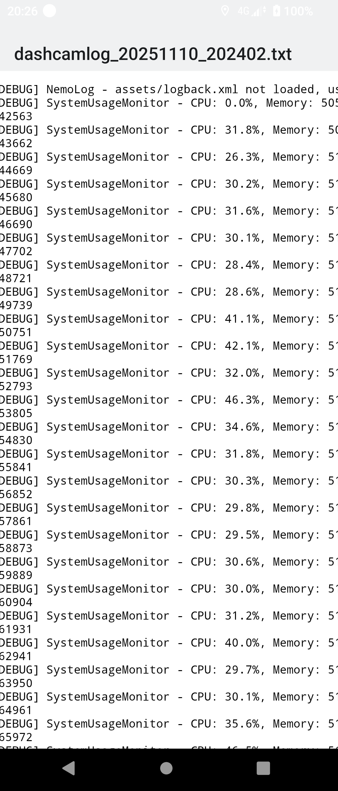
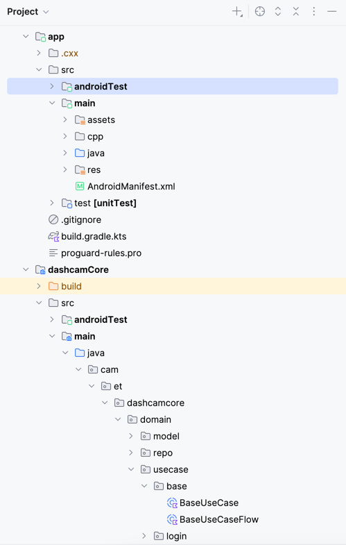
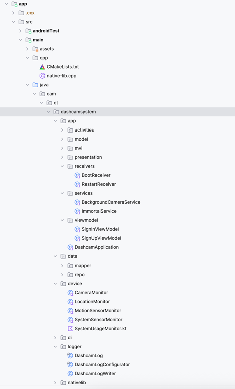
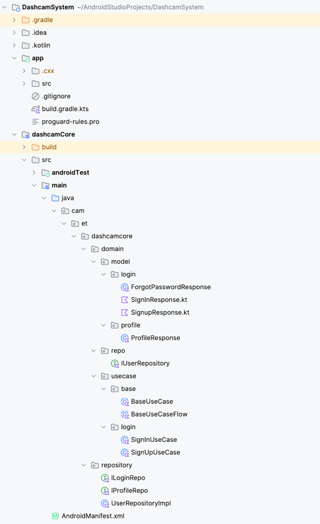

DashcamSystem
=============

Short description
-----------------
DashcamSystem is an Android app that runs a background foreground-service which periodically captures still JPEG images from the device camera, performs a lightweight luminance check in native code to detect low-light frames, saves images using a native POSIX write helper, and appends events to an application-managed log directory.

Tech Stack
----------
- Language: Kotlin, JAVA
- Architecture: MVI + Clean Architecture
- Design Principles: SOLID, Dependency Injection
- Android Components: ForegroundService, BroadcastReceiver, LifecycleObserver
- Logging: slf4j, Logger, Log writting

Key components
--------------
- app/src/main/java/cam/et/dashcamsystem/app/services/BackgroundCameraService.kt
  - Foreground service that opens the camera, captures images on a 30s interval, checks darkness via native code, saves images, and writes log entries with timestamp + location.
- app/src/main/java/cam/et/dashcamsystem/nativelib/NativeLib.kt
  - JNI bridge to native functions built from app/src/main/cpp/native-lib.cpp
  - native functions:
    - isImageDark(pixels: IntArray, width: Int, height: Int, threshold: Int): Boolean
    - saveBytesToFile(path: String, bytes: ByteArray): Boolean
    - appendLog(path: String, line: String): Boolean
- app/src/main/cpp/native-lib.cpp
  - C++ implementations: average luminance calculation, POSIX file write/append.
- app/src/main/java/cam/et/dashcamsystem/device/FilePathManager.kt
  - Helper to manage application directories for logs, images and results. By default the app writes under a "DashcamSystem" directory on external storage when writable, otherwise app-scoped storage.

Native code
-----------
- Native library name: `bgcamapp` (loaded with System.loadLibrary("bgcamapp")).
- Native code uses POSIX open/write/fsync to persist bytes and append log lines for efficiency.
- isImageDark calculates average luminance (using integer weights 0.299/0.587/0.114) and compares against a threshold passed from Kotlin.

Permissions
-----------
The `app/src/main/AndroidManifest.xml` already declares the following permissions required by `BackgroundCameraService`:
- android.permission.CAMERA
- android.permission.FOREGROUND_SERVICE
- android.permission.ACCESS_FINE_LOCATION
- android.permission.ACCESS_COARSE_LOCATION
- android.permission.RECEIVE_BOOT_COMPLETED
- (Android 13+) android.permission.POST_NOTIFICATIONS
- (Android 13+) android.permission.READ_MEDIA_IMAGES
- (legacy) android.permission.READ_EXTERNAL_STORAGE / WRITE_EXTERNAL_STORAGE
- android.permission.MANAGE_EXTERNAL_STORAGE (requires special user approval)
- (Android 14+) android.permission.FOREGROUND_SERVICE_CAMERA and FOREGROUND_SERVICE_LOCATION

Note: Runtime permission requests are required for CAMERA, LOCATION and Notifications on modern Android. `BackgroundCameraService` checks camera permission, but your UI should request CAMERA and LOCATION (and notification) permissions before starting the service.

Build & run
-----------
Requirements:
- Android SDK and NDK configured (project sets ndkVersion = "25.2.9519653").
- Java 11
- Gradle wrapper (the project includes gradle wrapper files).

Common commands (from project root):

- Build the app (assemble debug):
  ./gradlew :app:assembleDebug

- Install to a connected device/emulator and run:
  ./gradlew :app:installDebug

- Build native library (happens during Gradle build) — CMake and NDK must be available.

Usage
-----
1. Ensure the application has been granted CAMERA and LOCATION runtime permissions.
2. Start the `BackgroundCameraService` from the app UI or by sending a foreground service Intent.
3. The service runs as a foreground service (notification channel `bgcam`). It captures an image every ~30 seconds and writes images and logs.

Files & storage
---------------
- Images saved by `BackgroundCameraService` (when using `getExternalFilesDir(Environment.DIRECTORY_PICTURES)`) are under an app-scoped pictures directory: e.g. /.../Android/data/cam.et.dashcamsystem/files/Pictures/BgCam/IMG_YYYYMMDD_HHMMSS.jpg
- Application-managed root directory: `DashcamSystem/` at external storage root (if writable), otherwise in app-specific external or internal storage. Inside it:
  - DashcamSystem/logs/  (events.txt and other logs)
  - DashcamSystem/images/  (images when using FilePathManager.getImagesDir())
  - DashcamSystem/results/

Screenshots
-----------
Below are compact thumbnails of the app screens (files are in the `screenshots/` folder). Click an image to view the full-size file in the repository.

Table layout (3 columns):

| Main Screen 1 | Main Screen 2 | Low Light Detection |
|---|---|---|
|  |  |  |

| Camera Logs (per-capture) | Logs List | System Log / Diagnostics |
|---|---|---|
|  |  |  |

| Project File Structure | Project File Structure (app) | Project File Structure (core) |
|---|---|---|
|  |  |  |

Next steps / Improvements
------------------------
- Add runtime permission UI flows (request CAMERA, LOCATION, and notifications) before starting the service.
- Allow configuration of capture interval and luminance threshold via SharedPreferences or UI.
- Add handling for image decoding to reduce memory use when decoding full-sized images for the luminance check.
- Improve power/thermal handling: throttle capture rate when battery is low or device is hot.

License
-------
Add appropriate license text here (e.g., Apache-2.0 or MIT) if you want to open-source the project.

Contact / Maintainers
---------------------
Project structure and code by the repository owner.
